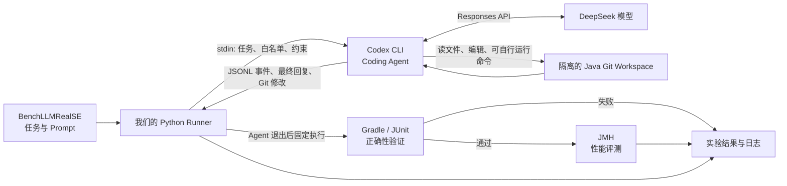

# BenchLLMRealSE Agent 实验进度与架构

最后更新：2026-10-09

## 目标

在 BenchLLMRealSE 的 Java 性能优化任务上，把原来“直接调用 LLM 生成文本补丁”的方式
替换为 Codex CLI Coding Agent。第一阶段仍使用 DeepSeek 模型，先验证单个真实任务
`RoaringBitmap/1de6825` 能否完整完成：理解任务、修改代码、通过单元测试并完成 JMH
评测。

## 状态字段归属

下面四个字段不是 Codex 提供的一组统一参数，而是控制器把 Codex 状态和我们自己的实验
状态关联起来后的运行记录：

| 字段 | 归属 | 用途 |
| --- | --- | --- |
| `thread_id` | Codex 生成 | 标识 Codex 对话线程；只有启用持久化/恢复时才需要保存 |
| `run_id` | 我们的控制器生成 | 唯一标识一次 benchmark 运行 |
| `workspace_path` | 我们的控制器管理 | 指向该次运行独占的 Git 工作区 |
| `run_state` | 我们的控制器定义 | 保存阶段、轮数、预算、测试结果和最终状态 |

三类状态必须分别管理：

1. Codex 线程状态：对话历史和 Agent 上下文。
2. 工作区状态：实际源码、Git 基线和 Agent 修改。
3. 实验状态：任务、模型、预算、日志、评测结果和产物路径。

仅恢复 `thread_id` 不会自动恢复被删除的工作区；仅保留工作区也不会恢复之前的对话上下文。

## 第一阶段架构

第一阶段的边界：

- 一个任务启动一次 `codex exec`。
- Codex 在单次运行内部可以多次查看文件、修改代码、运行测试并根据结果继续推理。
- Runner 等 Codex 退出后，再运行权威的外部 JUnit 和 JMH。
- 外部评测结果暂不反馈给 Agent，因此当前使用 `--ephemeral` 是有意选择，不是会话恢复实现。
- Runner 只接受任务 JSON 中 `source_code` 指定的源码文件发生变化。
- 最终依据是 Git patch、JUnit/JMH 结果与 JSONL 事件，不采信 Agent 自己声称“已经成功”。

## 第二阶段设想（尚未实施）

如果第一阶段能够稳定完成单任务，再增加最多三轮的外部反馈循环：

1. 去掉 `--ephemeral`，从 Codex 事件中记录 `thread_id`。
2. 为每次运行持久化 `run_id → thread_id + workspace_path + run_state` 映射。
3. 外部测试失败时，把经过裁剪的失败日志发送到同一 Codex 线程，并继续使用同一工作区。
4. Agent 可见的单元测试和公共性能测试可先封装为受控 shell wrapper；需要跨 Agent、跨机器
   复用时再暴露为 MCP 工具。
5. 保留独立的最终评测，避免 Agent 针对唯一可见 JMH case 过拟合。

## 已完成

- Python runner 已接入 BenchLLMRealSE `Dataset/PerfOpt` 任务格式。
- 已实现 buggy revision 校验、clean workspace 校验和源码修改白名单。
- 已实现 Codex JSONL、stderr、最终回复、Git patch、测试日志和 benchmark 日志归档。
- 服务器已安装用户级 Codex CLI `0.161.0`。
- 已配置 DeepSeek Responses API provider，指定模型为 `deepseek-v4-pro`。
- DeepSeek/Codex 连接烟雾测试返回 `DEEPSEEK_CODEX_OK`。
- `1de6825` dry run 已通过；目标源码为
  `RoaringBitmap/src/main/java/org/roaringbitmap/art/Node16.java`。
- 目标工作区基线为 `34bce1bae5591347d1992daae0cdb041a409cc1d`，即修复提交
  `1de68254774c3d1932ee025cb331f60dd4e904d0` 的父提交。

## 当前执行计划

1. 确认服务器上的任务工作区仍然 clean，且 `Node16.java` 没有上次中断遗留修改。
2. 准备 Gradle 6.3 和任务所需依赖；依赖准备阶段不计入 Agent 能力。
3. 先执行权威单元测试命令，确认 buggy baseline 可构建。
4. 正式运行 Codex Agent。
5. Agent 退出后由 Runner 执行目标 JUnit 和 JMH，并归档完整结果。

## 已知风险

- 服务器访问 Gradle 分发站点曾发生网络超时；这是基础设施问题，不应记为 Agent 失败。
- `1de6825` 的 JMH 类是修复提交新增的文件，在 buggy parent 中不存在。评测 wrapper 会在
  Agent 退出后从修复提交提取该 benchmark 源码，运行完成后删除；该文件不会暴露给
  Agent，也不计入 Agent patch。
- JMH 命令必须使用适用于当前 RoaringBitmap revision 的权威调用，不能直接复用会重置 Git
  或应用旧式文本 patch 的 BenchLLMRealSE shell 脚本。
- 第一阶段不具备跨进程会话恢复；这将在第二阶段单独实现和评测。
