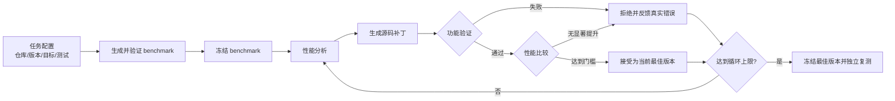

# 基于大模型的 Python 性能优化闭环（v0.1）

本项目验证一条最小但完整的技术路线：让大模型为真实 Python 代码生成性能测试，依据测试与性能证据修改源码，再由确定性的工具完成正确性验证、性能测量、接受或拒绝，并将真实结果反馈给下一轮。


## 当前已经完成什么

1. **生成性能测试**：DeepSeek 根据目标函数源码生成 `pyperf` benchmark。
2. **自动修复测试**：把语法、导入和运行错误反馈给模型，允许有限次数修复。
3. **冻结可信 workload**：benchmark 通过检查后固定文件与 SHA-256，优化阶段不能修改它。
4. **分析并生成补丁**：模型读取目标源码、相关测试与上一轮证据，输出 unified diff。
5. **验证功能正确性**：运行定向测试、完整测试、额外行为检查与动态目标命中检查。
6. **测量性能与资源**：记录 pyperf 运行时间、CPU 时间、峰值 RSS、`tracemalloc` 峰值以及平台可用的 I/O 指标。
7. **有界优化循环**：候选不正确或没有达到门槛就拒绝并回退；循环达到上限后停止。
8. **独立标准复测**：冻结模型生成的代码后，在不调用 LLM 的情况下重新比较 Baseline、官方人工修复与 DeepSeek 修复。

## 第一版结果

### 实验一：LLM 生成 pyperf benchmark

- 项目：SymPy、mpmath
- 目标函数：10 个
- 每个目标独立生成 3 次，共 30 个候选
- 初次运行通过：21/30（70.0%）
- 自动修复后运行通过：29/30（96.7%）
- 人工确认语义正确：28/30（93.3%）

这个实验说明 DeepSeek 能够生成并修复 Python 性能测试，但“可以运行”不等于“测试语义正确”，仍需目标命中检查与语义复核。

详细结果见 [`experiments/2026-09-15_benchmark-generation-feasibility/`](experiments/2026-09-15_benchmark-generation-feasibility/)。

### 实验二：More-itertools 真实仓库优化闭环

- 目标：`more_itertools.recipes.triplewise`
- Baseline：官方性能修复前的历史提交
- Human Fix：官方人工修复提交
- DeepSeek Fix：框架经过最多 3 轮产生的最佳版本
- benchmark：由 DeepSeek 生成，通过验证后冻结

在本机 pyperf 标准模式复测中：

| 版本 | 主 workload median | 相对 Baseline | 与 Baseline 差异显著 |
|---|---:|---:|:---:|
| Baseline | 36.09 ms | — | — |
| 官方 Human Fix | 18.54 ms | 快 48.62% | 是 |
| DeepSeek Fix | 18.20 ms | 快 49.56% | 是 |

DeepSeek Fix 与 Human Fix 的数值差约 1.8%，但 pyperf 判断两者差异不显著，因此当前结论是**性能基本相当**，而不是“模型超过人工”。

详细结果见 [`experiments/2026-09-17_more-itertools-triplewise-e2e/`](experiments/2026-09-17_more-itertools-triplewise-e2e/)。

## 框架流程



并非每个环节都调用大模型：

- **调用 LLM**：benchmark 生成/修复、性能分析、补丁生成、反思总结。
- **确定性程序完成**：Git 隔离、补丁白名单、语法检查、单元测试、目标命中、pyperf、资源采集、显著性判断、回退和停止条件。

当前系统可以称为“有界的 Agent 工作流”：模型负责需要推理和生成的步骤，控制器根据外部工具证据决定下一步。它还不是能够任意探索仓库和自主调用工具的通用 Coding Agent。

## 仓库结构

```text
perf-benchmark-poc/
├── config/          # 任务、版本、测试、阈值和循环上限
├── prompts/         # benchmark、分析、补丁和反思提示词
├── src/
│   ├── benchmark/   # 第一阶段 benchmark 生成与验证
│   ├── framework/   # 真实仓库闭环、评估、补丁和仓库隔离
│   └── llm/         # DeepSeek 客户端
├── scripts/         # 命令行入口、复测与辅助脚本
├── subjects/        # 固定检查脚本及早期实验目标
├── tests/           # 框架自身的单元测试
├── experiments/     # 适合提交、复核和汇报的精简实验档案
└── artifacts/       # 本机完整原始运行产物，默认不提交 Git
```

## 环境准备

需要 Python 3.9 或更高版本。当前归档实验使用 Python 3.11.1。

```bash
python3 -m venv .venv
.venv/bin/python -m pip install -r requirements.txt
cp .env.example .env
```

在 `.env` 中设置 DeepSeek API 密钥。真实 `.env` 已被 Git 忽略，不要提交密钥。

先验证环境与模型连接：

```bash
.venv/bin/python -m unittest discover -s tests -v

set -a
source .env
set +a
.venv/bin/python scripts/test_deepseek_connection.py
```

## 运行第一阶段 benchmark 生成实验

单个目标：

```bash
set -a
source .env
set +a
.venv/bin/python scripts/run_poc.py --target sympy_expand_001
```

10 个目标各生成 3 次：

```bash
.venv/bin/python scripts/run_poc.py --repetitions 3
```

## 运行真实仓库端到端闭环

当前第一版配置只运行 1 个独立 Run、最多 3 轮，目的是先打通流程：

```bash
set -a
source .env
set +a
.venv/bin/python scripts/run_framework.py \
  --config config/more_itertools_triplewise_e2e.yaml
```

完整产物写入 `artifacts/more_itertools_triplewise_e2e/<运行时间>/`。其中包含模型输入输出、候选补丁、测试日志、性能数据、资源数据和最终决定。

## 对冻结结果做无 LLM 标准复测

闭环结束后，将命令中的目录替换为终端打印的实际产物目录：

```bash
.venv/bin/python scripts/retest_e2e.py \
  --artifacts artifacts/more_itertools_triplewise_e2e/<运行时间>
```

这个步骤默认使用 pyperf 标准模式，不读取 `.env`、不调用 DeepSeek，也不会产生 API 费用。它用于将“代码生成”与“最终性能测量”分离。

## 实验归档规范

`artifacts/` 保存本机完整证据，通常体积较大且带有临时路径；`experiments/` 只保存适合 Git 和汇报的关键材料。实验目录采用：

```text
YYYY-MM-DD_项目或阶段_目标或实验目的
```

每个归档至少包含：

- 中文说明与结论；
- 任务配置快照；
- 冻结 benchmark 或其哈希；
- 候选补丁和接受/拒绝记录；
- 汇总数据及必要的环境信息；
- 结论边界和下一步计划。

详见 [`experiments/README.md`](experiments/README.md)。

## 当前边界

- 真实仓库闭环目前只验证了一个目标函数，不能推广到所有 Python 项目。
- 标准复测在个人 电脑完成，可用于阶段判断。
- 当前目标由人工指定，尚未从 testcase 或 workload 自动定位性能热点。
- I/O 指标在 macOS 上可能不可用，本任务本身也是 CPU/运行时间优化。
- 当前使用 worktree/临时副本、修改白名单、哈希和超时进行基础隔离，但还没有真正的安全执行沙箱。

## 下一步

1. 增加基础 Docker 沙箱：测试进程无密钥、默认断网、非 root，并限制 CPU、内存、进程数和时间。
2. 从 testcase/workload 与 profiler 数据自动定位热点，而不是预先指定函数。
3. 再选择 2～3 个不同类型的真实任务，验证流程的泛化能力。
4. 在固定 Linux 服务器上使用相同环境复测 Baseline、Human Fix 和 DeepSeek Fix。
5. 后续再接入性能模式、反模式与历史修复案例的检索增强（RAG）。

## 安全提醒

LLM 生成的源码本质上是不可信代码。当前版本适合在受控仓库中进行研究预跑；在无人值守执行陌生仓库之前，应当把测试和 benchmark 放入一次性沙箱，并确保 DeepSeek API 密钥只存在于沙箱外的主控程序中。
