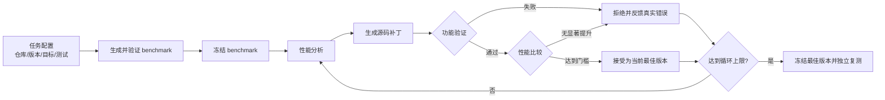

# 基于大模型的 Python 性能优化闭环（v0.2）

本项目验证一条最小但完整的技术路线：让大模型为真实 Python 代码生成性能测试，依据测试与性能证据修改源码，再由确定性的工具完成正确性验证、性能测量、接受或拒绝，并将真实结果反馈给下一轮。


## 当前已经完成什么

1. **生成性能测试**：DeepSeek 根据目标函数源码生成 `pyperf` benchmark。
2. **自动修复测试**：把语法、导入和运行错误反馈给模型，允许有限次数修复。
3. **冻结可信 workload**：benchmark 通过检查后固定文件与 SHA-256，优化阶段不能修改它。
4. **分析并生成补丁**：模型读取目标源码、相关测试与上一轮证据，输出 unified diff。
5. **验证功能正确性**：运行定向测试、完整测试、额外行为检查与动态目标命中检查。
6. **测量性能与资源**：记录 pyperf 运行时间、CPU 时间、峰值 RSS、`tracemalloc` 峰值以及平台可用的 I/O 指标。
7. **有界优化循环**：候选不正确或没有达到门槛就拒绝并回退；循环达到上限后停止。
8. **独立标准复测**：冻结模型生成的代码后，在不调用 LLM 的情况下重新比较 Baseline、官方人工修复与 DeepSeek 修复。
9. **Workload 候选构建**：扫描仓库已有 benchmark、testcase 和 examples，提取测试场景，必要时由 DeepSeek 补全为可测量脚本，再在 Docker 中验证。
10. **性能分类与 profiler 路由**：根据多规模 CPU/wall、内存与 I/O 证据记录 `cpu_bound`、`memory`、`io`、`mixed` 或 `unknown`，再选择 `cProfile`、`tracemalloc` 或进程 I/O 证据。

## 当前支持的两个入口

### 入口一：给定可信 workload，不指定目标函数

```text
仓库 + 可信 workload
→ CPU/内存/I/O 分类
→ 自动选择 profiler
→ 自动定位目标函数
→ DeepSeek 生成补丁
→ 功能与性能验收
```

CPython `urllib` 内存任务已经完整验证该入口。框架自动选择
`urllib.parse.unquote_to_bytes`，3 个候选全部功能正确，其中 1 个被接受；冻结结果的
无 LLM 复测显示 tracemalloc 峰值下降 95.47%，pyperf 中位运行时间改善 3.02%。
精简证据见
[`experiments/2026-09-23_cpython-urllib-auto-memory-e2e/`](experiments/2026-09-23_cpython-urllib-auto-memory-e2e/)。

### 入口二：只给仓库，不指定 testcase、workload 或目标函数

```text
仓库
→ 扫描 benchmark/testcase/examples
→ DeepSeek 选择场景并生成 workload
→ Docker 自动验收
→ profiler 自动定位目标
→ DeepSeek 生成补丁
→ 功能与性能验收
```

More-itertools 首次自主实验扫描出 150 个候选场景，模型选择 `PeekableTests`，生成并
修复 workload 后将 `peekable.__next__` 定位为 Top 1。两个补丁均通过功能测试，但性能
分别下降约 3.40% 和 14.93%，因此均被拒绝并正确回退。该 bad case 说明“可运行的
workload”和“耗时 Top 1”不一定对应真实且可优化的性能根因。精简证据见
[`experiments/2026-09-23_more-itertools-autonomous-workload-badcase/`](experiments/2026-09-23_more-itertools-autonomous-workload-badcase/)。

## 第一版结果

### 实验一：LLM 生成 pyperf benchmark

- 项目：SymPy、mpmath
- 目标函数：10 个
- 每个目标独立生成 3 次，共 30 个候选
- 初次运行通过：21/30（70.0%）
- 自动修复后运行通过：29/30（96.7%）
- 人工确认语义正确：28/30（93.3%）

这个实验说明 DeepSeek 能够生成并修复 Python 性能测试，但“可以运行”不等于“测试语义正确”，仍需目标命中检查与语义复核。

详细结果见 [`experiments/2026-09-15_benchmark-generation-feasibility/`](experiments/2026-09-15_benchmark-generation-feasibility/)。

### 实验二：More-itertools 真实仓库优化闭环

- 目标：`more_itertools.recipes.triplewise`
- Baseline：官方性能修复前的历史提交
- Human Fix：官方人工修复提交
- DeepSeek Fix：框架经过最多 3 轮产生的最佳版本
- benchmark：由 DeepSeek 生成，通过验证后冻结

在本机 pyperf 标准模式复测中：

| 版本 | 主 workload median | 相对 Baseline | 与 Baseline 差异显著 |
|---|---:|---:|:---:|
| Baseline | 36.09 ms | — | — |
| 官方 Human Fix | 18.54 ms | 快 48.62% | 是 |
| DeepSeek Fix | 18.20 ms | 快 49.56% | 是 |

DeepSeek Fix 与 Human Fix 的数值差约 1.8%，但 pyperf 判断两者差异不显著，因此当前结论是**性能基本相当**，而不是“模型超过人工”。

详细结果见 [`experiments/2026-09-17_more-itertools-triplewise-e2e/`](experiments/2026-09-17_more-itertools-triplewise-e2e/)。

## 框架流程



并非每个环节都调用大模型：

- **调用 LLM**：benchmark 生成/修复、性能分析、补丁生成、反思总结。
- **确定性程序完成**：Git 隔离、补丁白名单、语法检查、单元测试、目标命中、pyperf、资源采集、显著性判断、回退和停止条件。

当前系统可以称为“有界的 Agent 工作流”：模型负责需要推理和生成的步骤，控制器根据外部工具证据决定下一步。它还不是能够任意探索仓库和自主调用工具的通用 Coding Agent。

第一版性能分类器是确定性规则，不是训练模型。每次完整闭环会在实验目录生成
`task_classification.json` 和 `profiler_routing.json`。路由器会确定应该使用
`cProfile`、`tracemalloc` 或进程 I/O 证据。CPU 证据可复用自动目标发现结果；配置
`profiler_callback` 后会执行 callback 并产生内存分配 Top N；I/O 当前仍是进程总量。
这些专项证据可以进入模型上下文。默认 `optimization_objective: runtime` 保持原有
运行时间决策；配置为 `memory` 时，以 tracemalloc 峰值下降为主指标，并把运行时间
作为最大退化护栏。显式内存目标还会确保执行 tracemalloc，但不会改写规则分类结果。

内存任务的关键配置示例：

```yaml
optimization_objective: memory
min_memory_reduction_percent: 10.0
max_runtime_regression_percent: 10.0
```

callback 使用三个明确阶段：`prepare_workload()` 在 profile 外构造输入，
`run_workload(prepared)` 是唯一测量区间，snapshot 在返回对象仍存活时采集，最后由
`validate_workload(result)` 检查正确性。Docker 烟雾验证入口为：

```bash
.venv/bin/python scripts/smoke_test_profile_callback.py
```

可以单独运行三个已知标签的 Docker 受控场景：

```bash
.venv/bin/python scripts/run_task_classifier_smoke.py
```

该入口分别运行纯计算、内存增长和文件 I/O workload，用于验证分类规则与平台指标，
不调用 DeepSeek。真实任务样本积累后，再评估自动路由以及 Jev/DeepSeek 对照。

服务器上还可运行真实项目的资源信号实验：

```bash
docker build -f docker/classification-real.Dockerfile \
  -t perf-benchmark-classification-real:py311-v1 .
.venv/bin/python scripts/run_real_task_classification.py
```

该实验固定使用 openpyxl、fsspec、cachetools 和 smart_open 四个真实库，不调用 LLM。
真实任务可能同时具有多种瓶颈，因此验收目标资源信号，同时照实保留 `mixed` 分类。

## 仓库结构

```text
perf-benchmark-poc/
├── config/          # 任务、版本、测试、阈值和循环上限
├── prompts/         # benchmark、分析、补丁和反思提示词
├── src/
│   ├── benchmark/   # 第一阶段 benchmark 生成与验证
│   ├── framework/   # 真实仓库闭环、评估、补丁和仓库隔离
│   └── llm/         # DeepSeek 客户端
├── scripts/         # 命令行入口、复测与辅助脚本
├── subjects/        # 固定检查脚本及早期实验目标
├── tests/           # 框架自身的单元测试
├── experiments/     # 适合提交、复核和汇报的精简实验档案
└── artifacts/       # 本机完整原始运行产物，默认不提交 Git
```

## 环境准备

需要 Python 3.9 或更高版本。当前归档实验使用 Python 3.11.1。

```bash
python3 -m venv .venv
.venv/bin/python -m pip install -r requirements.txt
cp .env.example .env
```

在 `.env` 中设置 DeepSeek API 密钥。真实 `.env` 已被 Git 忽略，不要提交密钥。

先验证环境与模型连接：

```bash
.venv/bin/python -m unittest discover -s tests -v

set -a
source .env
set +a
.venv/bin/python scripts/test_deepseek_connection.py
```

## 运行第一阶段 benchmark 生成实验

单个目标：

```bash
set -a
source .env
set +a
.venv/bin/python scripts/run_poc.py --target sympy_expand_001
```

10 个目标各生成 3 次：

```bash
.venv/bin/python scripts/run_poc.py --repetitions 3
```

## 运行真实仓库端到端闭环

当前第一版配置只运行 1 个独立 Run、最多 3 轮，目的是先打通流程：

```bash
set -a
source .env
set +a
.venv/bin/python scripts/run_framework.py \
  --config config/more_itertools_triplewise_e2e.yaml
```

完整产物写入 `artifacts/more_itertools_triplewise_e2e/<运行时间>/`。其中包含模型输入输出、候选补丁、测试日志、性能数据、资源数据和最终决定。

## 对冻结结果做无 LLM 标准复测

闭环结束后，将命令中的目录替换为终端打印的实际产物目录：

```bash
.venv/bin/python scripts/retest_e2e.py \
  --artifacts artifacts/more_itertools_triplewise_e2e/<运行时间>
```

这个步骤默认使用 pyperf 标准模式，不读取 `.env`、不调用 DeepSeek，也不会产生 API 费用。它用于将“代码生成”与“最终性能测量”分离。

## 实验归档规范

`artifacts/` 保存本机完整证据，通常体积较大且带有临时路径；`experiments/` 只保存适合 Git 和汇报的关键材料。实验目录采用：

```text
YYYY-MM-DD_项目或阶段_目标或实验目的
```

每个归档至少包含：

- 中文说明与结论；
- 任务配置快照；
- 冻结 benchmark 或其哈希；
- 候选补丁和接受/拒绝记录；
- 汇总数据及必要的环境信息；
- 结论边界和下一步计划。

正式实验汇总见 [`experiments/REPORT_ZH.md`](experiments/REPORT_ZH.md)，归档规则见
[`experiments/README.md`](experiments/README.md)。

## 当前边界

- 已在运行时间和内存任务上跑通真实仓库闭环，但样本量仍不足以推广到所有 Python 项目。
- 正式性能数据已在固定 Linux 服务器复测；本机 `--fast` 结果只用于开发和流程检查。
- 已实现从仓库扫描、选择和生成单个 workload 的自主入口；尚未实现多个 workload
  的联合比较，也没有验证复杂调用链中的多候选热点选择。
- I/O 当前只能完成任务分类和进程级总量记录，尚不能稳定归因到具体 Python 函数。
- 当前使用独立临时 clone、修改白名单和 Docker 基础沙箱；代码只读挂载，
  网络、CPU、内存、进程数和超时均有限制。它仍是科研原型，不等同于生产级恶意代码隔离。

## 接受补丁与发布

候选补丁在独立实验副本中通过功能测试、目标函数 benchmark 和原始 workload
验收后，框架生成 `release_candidate/best.patch` 与 `manifest.json`。实验副本默认清理，
原仓库不会被修改。

需要将候选放到真实仓库供人工审查时，显式运行：

```bash
.venv/bin/python scripts/promote_release_candidate.py \
  --artifacts <实验目录> \
  --target-repository <干净且位于基线提交的仓库> \
  --config config/more_itertools_triplewise_auto_e2e.yaml \
  --branch codex/perf-triplewise \
  --apply
```

该命令只创建审查分支、应用已验收补丁并在 Docker 中重跑功能测试；不会自动
commit、merge 或 push。

## 自动热点定位（第一版）

当前已加入一个独立的热点发现预处理阶段。它不要求配置
`target_file` 或 `target_symbol`，而是执行给定 workload，使用 `cProfile`
采集数据，再过滤仓库外部代码、测试与 benchmark，按照函数自身耗时输出
Top 5 热点。

已知答案 `validation_expected_symbol` 只在排名结束后用于验收，不参与
workload 执行、过滤或排序，也不会作为后续模型输入。

本地运行：

```bash
cd /path/to/perf-benchmark-poc
.venv/bin/python scripts/discover_hotspots.py \
  --config config/more_itertools_triplewise_hotspot.yaml
```

该配置默认通过 Docker 运行 workload，需要先启动 Docker Desktop；首次运行会使用
官方 `python:3.11-slim` 基础镜像。容器默认断网、使用非 root 用户，仓库和
workload 以只读方式挂载，并限制 CPU、内存、进程数和执行时间。

结果保存在 `artifacts/hotspot_discovery/<时间>/`：

- `profile.prof`：原始 cProfile 数据；
- `hotspots.json`：结构化热点、耗时、调用次数和验收结果；
- `REPORT_ZH.md`：中文简表；
- `stdout.txt`、`stderr.txt`：workload 的原始输出。

该入口目前只用于受控的已知仓库验证。完整闭环中的 workload、测试、benchmark
和候选代码均已接入 Docker 基础沙箱，但它仍不是生产级恶意代码隔离环境。

可以单独验证沙箱的非 root、密钥隔离、只读仓库、断网、超时和内存限制：

```bash
.venv/bin/python scripts/validate_sandbox.py
```

验证结果保存在 `artifacts/sandbox_validation/<时间>/`。只有所有限制均实际生效时，
脚本才会返回成功。

## 自动目标端到端闭环

`target_mode: auto` 配置不需要填写 `target_file` 或 `target_symbol`。框架先在
Docker 沙箱中执行 workload，根据 `cProfile` 的项目内函数自身耗时选择第一热点，
再将目标文件、目标函数和 Top 5 profiler 证据传入 benchmark 生成、代码分析、
补丁生成、功能测试和性能验证流程。

低成本单轮验证配置：

```bash
set -a
source .env
set +a
.venv/bin/python scripts/run_framework.py \
  --config config/more_itertools_triplewise_auto_e2e.yaml
```

该模式目前采用确定性的第一热点选择；尚未让模型在 Top N 热点中进一步判断。
原始端到端 workload 已作为补丁接受条件，与目标函数 benchmark 同时达标才接受。

## 从 testcase 构建 Workload 候选

受控实验会从 `tests/test_recipes.py` 提取调用 `triplewise()` 的测试类，仅把目标函数
源码和该测试证据交给 DeepSeek 放大为可测量脚本。生成脚本先通过正确结果、重复
执行和动态目标命中检查，再与人工历史 workload 各运行三次 profiler。

```bash
set -a
source .env
set +a
.venv/bin/python scripts/run_workload_builder_experiment.py \
  --config config/more_itertools_triplewise_auto_e2e.yaml \
  --repetitions 3
```

当前已完成两个真实任务：从 More-itertools testcase 派生 `triplewise()` workload，
以及从 attrs 已有 benchmark 派生 `attrs.asdict()` workload。两项修正后都连续三次
定位到与参考场景相同的 Top 1。派生脚本只是自动验收通过的候选，尚未经过人工代表性
确认，不能直接称为真实业务 workload。中间验证和框架演进过程见
[`EXPERIMENT_EVOLUTION_ZH.md`](EXPERIMENT_EVOLUTION_ZH.md)；正式实验结果以
[`experiments/REPORT_ZH.md`](experiments/REPORT_ZH.md)为准。

人工审阅脚本内容和 `workload_spec.json` 后，可以用以下显式命令冻结；必须填写
完全匹配的脚本 SHA-256，命令不会修改原候选：

冻结前还必须满足 `fidelity_status=PASS`。第一版保真门禁会检查原场景中的关键
对象构造是否仍出现在派生脚本中；如果被替换，则记录
`adaptation_type=structure_changed`、`fidelity_status=REVIEW_REQUIRED` 并拒绝冻结。

```bash
.venv/bin/python scripts/freeze_workload.py \
  --artifacts <Workload Builder 实验目录> \
  --reviewer <审阅者> \
  --rationale <确认其代表性的理由> \
  --confirm-sha256 <workload_spec.json 中的完整哈希>
```

## Docker 执行镜像

热点 workload、语法与导入检查、定向和完整测试、行为检查、pyperf、资源测量
以及候选补丁代码均可在受限 Docker 容器内执行。DeepSeek API 调用和补丁应用
仍由容器外的可信控制器负责，API 密钥不会传入执行容器。

首次使用或 Dockerfile 变化后构建固定执行镜像：

```bash
docker build -f docker/sandbox.Dockerfile \
  -t perf-benchmark-sandbox:py311-v1 .
```

可以使用已有 benchmark 和候选补丁做无 LLM 重放验证：

```bash
.venv/bin/python scripts/smoke_test_execution_sandbox.py \
  --benchmark <冻结的 benchmark.py> \
  --patch <候选 best.patch>
```

容器内监控包装器会记录 wall time、进程树 CPU、峰值 RSS 和平台支持的 I/O，
pyperf 与 tracemalloc 仍分别负责稳定计时和 Python 内存分配测量。

## 下一步

1. 一个仓库保留多个候选 workload，不再只选择一个场景后固定到底。
2. 完善 Top N 热点选择，加入自身耗时、累计耗时、调用关系、跨规模趋势和排名稳定性。
3. 连续补丁没有提升时，自动切换热点或 workload，并保留完整失败证据。
4. 在 3～5 个具有历史人工修复的真实任务上建立无 RAG 基线。
5. 对比规则、DeepSeek 与 Jev 在 workload、性能类型和优化目标选择上的准确率、成本和稳定性。
6. 无 RAG 基线稳定后，再接入性能模式、反模式与历史修复案例的检索增强（RAG）。

## 安全提醒

LLM 生成的源码本质上是不可信代码。当前版本适合在受控仓库中进行研究预跑；在无人值守执行陌生仓库之前，应当把测试和 benchmark 放入一次性沙箱，并确保 DeepSeek API 密钥只存在于沙箱外的主控程序中。
